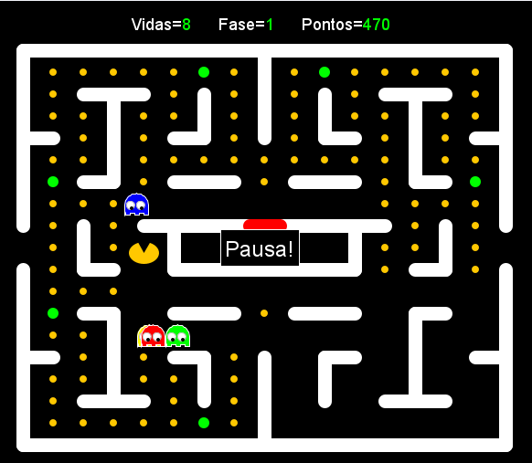

# Jogo de Pacman

Veja abaixo uma captura de tela do jogo de Pacman:



Para rodar o jogo, basta baixar o arquivo Pacman-5.0.jar e rodar executando o seguinte comando:

```
java -jar Pacman-5.0.jar
```

Obs, para funcionar depende do java 1.8 ou superior instalado na máquina